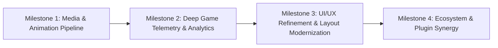

# Penumbra Themes Suite — Roadmap

This document outlines the strategic roadmap, planned architectural enhancements, and plugin integrations for the **Penumbra Themes Suite** ([Penumbra Dawn](file:///X:/Github%20Workspace/playnite/PenumbraThemes/source/PenumbraDawn), [Penumbra Night](file:///X:/Github%20Workspace/playnite/PenumbraThemes/source/PenumbraNight), and [Penumbra Blur](file:///X:/Github%20Workspace/playnite/PenumbraThemes/source/PenumbraBlur)).

---

## 🎯 Active Strategic Goals



---

## 🚀 Milestone 1: ImageRotater Integration (Animated Covers & Dynamic Backgrounds)

Integration of the official fast-path theme rendering controls defined in [ImageRotater Theme Integration Guide](https://github.com/Mike-Aniki/ImageRotater/blob/main/docs/THEME_INTEGRATION.md).

### Background & Architecture
- **Problem**: Traditional metadata-driven slideshows update Playnite's native `Game.BackgroundImage` and `Game.CoverImage` in SQLite, triggering cascading database events across all installed plugins and causing micro-stutters.
- **Solution**: Native fast-path plugin controls that render animated covers (GIF, MP4, WebM) and rotating high-res backgrounds directly from plugin storage without database writes.

### Implementation Tasks

1. **Cover Hosting Controls (`ImageRotater_Cover`)**:
   - [ ] Inject `<ContentControl x:Name="ImageRotater_Cover" HorizontalAlignment="Stretch" VerticalAlignment="Stretch"/>` as a sibling immediately after `PART_ImageCover` in:
     - `source/PenumbraDawn/Views/LibraryGridView.xaml`
     - `source/PenumbraNight/Views/LibraryGridView.xaml`
     - Details View cover templates (`DetailsViewGameOverview.xaml`)
   - [ ] Ensure non-destructive layering: control remains completely transparent when no rotating artwork is present, revealing the native Playnite cover underneath.
   - [ ] Add conditional triggers for active rotation states via `{PluginSettings Plugin=ImageRotater, Path=EnableCoverImage}` and `{PluginSettings Plugin=ImageRotater, Path=HasDataCover}`.

2. **Background Hosting Controls (`ImageRotater_Background`)**:
   - [ ] Add `<ContentControl x:Name="ImageRotater_Background" HorizontalAlignment="Stretch" VerticalAlignment="Stretch"/>` directly above the default background layer in both Dawn and Night.
   - [ ] Implement seamless coexistence with `BackgroundChanger`: prioritize `ImageRotater_Background` when active while preserving fallback to `BackgroundChanger_Background` and native `Game.BackgroundImage`.

3. **Performance & Lifecycle Safety**:
   - [ ] Maintain virtualization compliance in `PART_ListGames` with pixel scrolling enabled.
   - [ ] Prevent duplicate media decoders or parallel WPF render passes.

---

## 📊 Milestone 2: GameActivity Deep Integration (Charts & Logs)

Full visual integration of telemetry, playtime analytics, and session logs based on the [Lacro59 GameActivity Wiki](https://github.com/Lacro59/playnite-gameactivity-plugin/wiki) and SDK endpoints.

### Exposed Elements & Components
Penumbra currently integrates `GameActivity_PluginButton`. This milestone expands integration to the full control suite:

| Control | Role in Theme | Target Location |
|---|---|---|
| `GameActivity_PluginButton` | Quick launcher & session overview button | Action bar / Header |
| `PART_CustomGameActivityButton` | Theme-styled click-trigger for full activity window | Quick access tool strip |
| `GameActivity_PluginChartTime` | Playtime trends & activity timeline curve | Game Details Tab / Overview |
| `GameActivity_PluginChartLog` | Tabular log of individual gameplay sessions | Dedicated "Activity" Details Tab |

### Implementation Tasks

1. **Activity Timeline (`PluginChartTime`)**:
   - [ ] Add `<ContentControl x:Name="GameActivity_PluginChartTime" MinHeight="160" MaxHeight="240" Margin="0,10,0,10"/>` in `DetailsViewGameOverview.xaml`.
   - [ ] Wire visibility to settings:
     ```xml
     Visibility="{PluginSettings Plugin=GameActivity, Path=Settings.EnableIntegrationChartTime, FallbackValue={x:Static Visibility.Collapsed}}"
     ```
   - [ ] Style chart background, gridlines, and tooltips to match Penumbra Dawn (slate/cyan) and Penumbra Night (teal/deep dark) color palettes.

2. **Session Log Viewer (`PluginChartLog`)**:
   - [ ] Implement an "Activity" tab in Penumbra Night's expander tabs alongside Reviews and Screenshots.
   - [ ] Integrate `<ContentControl x:Name="GameActivity_PluginChartLog" .../>` bound to:
     ```xml
     Visibility="{PluginSettings Plugin=GameActivity, Path=Settings.EnableIntegrationChartLog, FallbackValue={x:Static Visibility.Collapsed}}"
     ```
   - [ ] Ensure smooth scrolling and virtualization when browsing extensive play histories.

3. **Custom Activity Button (`PART_CustomGameActivityButton`)**:
   - [ ] Provide unified vector-icon button matching Penumbra's button styles that directly triggers GameActivity's modal window via standard WPF event routing.

---

## 🎨 Milestone 3: Theme Suite Refinements & Aesthetics

1. **Penumbra Dawn**:
   - [ ] Harmonize glassmorphism borders and contrast ratios for light/dark transition areas.
   - [ ] Verify font hierarchy and responsive wrapping on high-DPI displays (4K / Ultrawide).
2. **Penumbra Night**:
   - [ ] Expand tabbed expander bar to unify GameActivity, CheckDLC, ScreenshotsVisualizer, and ReviewViewer.
   - [ ] Refine trailer video controls overlay (play/pause/mute) with subtle fade-on-hover micro-animations.
3. **Penumbra Blur**:
   - [ ] Deepen ThemeModifier variable presets for adjustable blur radius and tint opacity.
   - [ ] Update installer manifests and store packages.

---

## 🧩 Milestone 4: SCVerse & Extended Ecosystem Synergy

1. **Roberts Space Industries (RSI) Ecosystem**:
   - [x] Dedicated 600×100 Library Banner for Star Citizen installations.
   - [ ] Live RSI Server Status widget styling inside Penumbra's Top Panel when `StarCitizenCompanion` is installed.
   - [ ] Display active pilot callsign and current PU shard in Game Details header for Star Citizen.
2. **DuplicateHiderNG Support**:
   - [ ] Optimize source-badge priority display across all views.
   - [ ] Custom group badge rendering with streamlined margins.

---

## 📅 Target Release Schedule

- **v1.3.0 (Next Major)**: Full `ImageRotater` support (Cover + Background) & `GameActivity` Chart/Log integration.
- **v1.4.0**: Expanded tab system, RSI Companion TopPanel integration, and 4K scaling pass.
