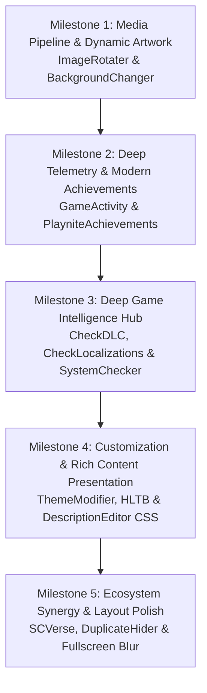

# Penumbra Themes Suite — Roadmap

This document outlines the strategic roadmap, planned architectural enhancements, and plugin integrations for the **Penumbra Themes Suite** ([Penumbra Dawn](file:///X:/Github%20Workspace/playnite/PenumbraThemes/source/PenumbraDawn), [Penumbra Night](file:///X:/Github%20Workspace/playnite/PenumbraThemes/source/PenumbraNight), and [Penumbra Blur](file:///X:/Github%20Workspace/playnite/PenumbraThemes/source/PenumbraBlur)).

---

## 🎯 Active Strategic Goals

---

## 🚀 Milestone 1: Media Pipeline & Dynamic Artwork (ImageRotater & BackgroundChanger)

Integration of the official fast-path theme rendering controls defined in [ImageRotater Theme Integration Guide](https://github.com/Mike-Aniki/ImageRotater/blob/main/docs/THEME_INTEGRATION.md) and seamless synergy with [BackgroundChanger](https://github.com/Lacro59/playnite-backgroundchanger-plugin/wiki/Addition-in-a-custom-theme).

### Background & Architecture
- **Problem**: Traditional metadata-driven slideshows write Playnite's native `Game.BackgroundImage` and `Game.CoverImage` directly to SQLite, triggering cascading database events across all installed plugins and causing micro-stutters during browsing.
- **Solution**: Native fast-path plugin controls that render animated covers (GIF, MP4, WebM) and rotating high-res backgrounds directly from memory/plugin storage without database writes.

### Implementation Tasks

1. **Cover Hosting Controls (`ImageRotater_Cover` & `BackgroundChanger_PluginCoverImage`)**:
   - [x] Inject `<ContentControl x:Name="ImageRotater_Cover" HorizontalAlignment="Stretch" VerticalAlignment="Stretch"/>` as a sibling immediately after `PART_ImageCover` in:
     - `source/PenumbraDawn/Views/LibraryGridView.xaml`
     - `source/PenumbraNight/Views/LibraryGridView.xaml`
     - Details View cover templates (`DetailsViewGameOverview.xaml`)
   - [x] Ensure non-destructive layering: controls remain completely transparent when no rotating artwork is present, revealing the native Playnite cover underneath.
   - [x] Maintain smooth transition between `ImageRotater_Cover`, `BackgroundChanger_PluginCoverImage`, and the static game cover.

2. **Background Hosting Controls (`ImageRotater_Background` & `BackgroundChanger_PluginBackgroundImage`)**:
   - [x] Add `<ContentControl x:Name="ImageRotater_Background" HorizontalAlignment="Stretch" VerticalAlignment="Stretch"/>` directly above the default background layer in both Dawn and Night.
   - [x] Implement seamless fallback chain: prioritize `ImageRotater_Background` when active, falling back to `BackgroundChanger_PluginBackgroundImage` and native `Game.BackgroundImage`.
   - [x] Standardize background context menu entries via `ThemeExtras.Menus.BackgroundChangerGameMenuItems` across all themes.

3. **Performance & Lifecycle Safety**:
   - [x] Maintain virtualization compliance in `PART_ListGames` with pixel scrolling enabled.
   - [x] Prevent duplicate media decoders or parallel WPF render passes.

---

## 📊 Milestone 2: Deep Telemetry & Modern Achievements (GameActivity & PlayniteAchievements)

Full visual integration of telemetry, playtime analytics, session logs, and modern achievement tracking based on the [Lacro59 GameActivity Wiki](https://github.com/Lacro59/playnite-gameactivity-plugin/wiki) and the [PlayniteAchievements Integration Guide](https://github.com/justin-delano/PlayniteAchievements/wiki/Theme-Bindings).

### Exposed Elements & Components

| Plugin | Control | Role in Theme | Target Location |
|---|---|---|---|
| **GameActivity** | `GameActivity_PluginButton` | Quick launcher & session overview button | Action bar / Header |
| **GameActivity** | `PART_CustomGameActivityButton` | Theme-styled click-trigger for full activity window | Quick access tool strip |
| **GameActivity** | `GameActivity_PluginChartTime` | Playtime trends & activity timeline curve | Game Details Tab / Overview |
| **GameActivity** | `GameActivity_PluginChartLog` | Tabular log of individual gameplay sessions | Dedicated "Activity" Details Tab |
| **PlayniteAchievements** | `PlayniteAchievements_AchievementButton` | Modern achievement window launcher | Action bar / Header |
| **PlayniteAchievements** | `PlayniteAchievements_AchievementProgressBar` | Completion progress bar with accent styling | Overview Header |
| **PlayniteAchievements** | `PlayniteAchievements_AchievementCompactList` | Horizontal row of recent/rare achievement badges | Overview panel |
| **PlayniteAchievements** | `PlayniteAchievements_AchievementBarChart` | Graphical progression curve over time | Achievements Tab |
| **PlayniteAchievements** | `PlayniteAchievements_AchievementDataGrid` | Full sortable achievement matrix with criteria | Dedicated Achievements Tab |

### Implementation Tasks

1. **GameActivity Timeline & Logs**:
   - [x] Add `<ContentControl x:Name="GameActivity_PluginChartTime" MinHeight="160" MaxHeight="240" Margin="0,10,0,10"/>` in `DetailsViewGameOverview.xaml` bounded to `EnableIntegrationChartTime`.
   - [x] Implement an "Activity" tab in Penumbra Night and Dawn's expander tabs hosting `GameActivity_PluginChartLog`.
   - [x] Wire custom stylized `PART_CustomGameActivityButton` matching Penumbra's vector icon button style.

2. **PlayniteAchievements Native & Dual-Support Architecture**:
   - [x] Implement native controls for `PlayniteAchievements_*` (`AchievementButton`, `AchievementProgressBar`, `AchievementCompactList`, `AchievementDataGrid`).
   - [x] Provide graceful backward-compatibility for installations still using `SuccessStory` via multi-binding / alias fallback.
   - [x] Integrate friend comparison previews (`PlayniteAchievements_AchievementFriendSummariesGrid`) into the achievements tab layout.

---

## 🔍 Milestone 3: Deep Game Intelligence Hub (CheckDLC, CheckLocalizations & SystemChecker)

Transforming the Details View into a rich intelligence hub by integrating DLC management, localization indicators, and hardware verification tools.

### Components Matrix

| Plugin | Control / Data | Presentation | Target Location |
|---|---|---|---|
| **CheckDLC** | `CheckDlc_PluginListDlcAll` | Dedicated DLC Expander Tab | Details View Tabs |
| **CheckDLC** | `CheckDlc_PluginButton` | DLC Manager Button | Quick Action Bar |
| **CheckLocalizations** | `CheckLocalizations_PluginFlags` | Supported language flag icons row | Details Metadata Header |
| **CheckLocalizations** | `CheckLocalizations_PluginListLanguages` | Full language support matrix (Audio/Sub/UI) | Details Expander Tab / Modal |
| **CheckLocalizations** | `CheckLocalizations_PluginButton` | Localization Manager Button | Quick Action Bar |
| **SystemChecker** | `SystemChecker_PluginButton` | Hardware check launcher | Quick Action Bar |
| **SystemChecker** | `IsAllOK` / `IsMinimumOK` / `RecommandedStorage` | Visual compatibility badge / drive requirement | System Requirements section |

### Implementation Tasks

1. **CheckDLC Tab Integration**:
   - [x] Create a dedicated "DLCs" tab in `DetailsViewGameOverview.xaml` alongside Achievements and Screenshots.
   - [x] Host `<ContentControl x:Name="CheckDlc_PluginListDlcAll" Height="320"/>`, visible only when `PluginSettings Plugin=CheckDlc, Path=HasData` is true.
   - [x] Style owned vs unowned DLC item badges to match Penumbra theme accents.

2. **CheckLocalizations Flags & Language Support**:
   - [x] Embed `<ContentControl x:Name="CheckLocalizations_PluginFlags" VerticalAlignment="Center" Margin="0,0,8,0"/>` in the metadata banner for immediate visual language availability.
   - [x] Add `CheckLocalizations_PluginListLanguages` into an info tab with stylized columns for Audio, Interface, and Subtitles.
   - [x] Add `CheckLocalizations_PluginButton` to the quick launcher toolstrip.

3. **SystemChecker Status Indicators**:
   - [x] Add `SystemChecker_PluginButton` to the action bar.
   - [x] Design sleek compatibility badge in the info panel reflecting `IsAllOK` (green), `IsMinimumOK` (amber), and recommended storage space (`RecommandedStorage`).

---

## 🎨 Milestone 4: Customization & Rich Content Presentation (ThemeModifier, HLTB & DescriptionEditor)

Refining user configurability through ThemeModifier, standardizing HowLongToBeat metrics, and elevating rich HTML description rendering.

### Implementation Tasks

1. **ThemeModifier Parity & Custom Icon Shapes**:
   - [x] Synchronize [thememodifier.yaml](file:///X:/Github%20Workspace/playnite/PenumbraThemes/source/PenumbraNight/thememodifier.yaml) between Dawn (41 keys), Night (expand to 30+ keys), and Blur (fullscreen sliders).
   - [x] Expose tint opacities, blur radii, button gradients, and font scaling options.
   - [x] Integrate `<ContentControl x:Name="ThemeModifier_PluginIcon"/>` inside `PART_GridImageContener` across grid and list views to support user-selected icon frame shapes (squircles, circles, hexes).

2. **HowLongToBeat Full Alignment**:
   - [x] Harmonize HLTB presentation: integrate `HowLongToBeat_PluginProgressBar` in Dawn and formatted text times in Night.
   - [x] Respect appearance toggles: bind individual category visibilities to `ShowMainTime`, `ShowExtraTime`, and `ShowCompletionistTime` to prevent empty layout rows when disabled by users.
   - [x] Optional: Add compact `HowLongToBeat_PluginViewItem` in grid item hover cards.

3. **DescriptionEditor HTML Engine Styling**:
   - [x] Upgrade `DescriptionView.html` across all three themes with rich responsive CSS:
     - Stylized tables with subtle borders, alternating row backgrounds, and theme-accent headers.
     - Formatted blockquotes, note callouts, and spoiler tags.
     - Responsive image handling with rounded corners (`img { max-width: 100%; border-radius: 6px; }`).

---

## 🧩 Milestone 5: Ecosystem Synergy & Layout Polish (SCVerse, Screenshots & Fullscreen Blur)

1. **Roberts Space Industries (RSI) Ecosystem**:
   - [x] Dedicated 600×100 Library Banner for Star Citizen installations.
   - [ ] Live RSI Server Status widget styling inside Penumbra's Top Panel when `StarCitizenCompanion` is installed.
   - [ ] Display active pilot callsign and current PU shard in Game Details header for Star Citizen.

2. **ScreenshotsVisualizer Gallery Expansion**:
   - [x] Provide toggle between vertical column (`PluginListScreenshotsVertical`) and horizontal responsive grid (`PluginScreenshots`).
   - [ ] Integrate single screenshot viewer modal triggered by click.

3. **Penumbra Blur (Fullscreen) Modernization**:
   - [x] Deepen ThemeModifier variable presets for adjustable blur radius, background tint, and font scaling.
   - [x] Integrate compact controller-navigable status badges for HLTB and Achievements.

4. **DuplicateHider Support**:
   - [x] Optimize source-badge priority display across all views.
   - [x] Custom group badge rendering with streamlined margins.

5. **Details View Ergonomics & Chip Badges**:
   - [x] Horizontal Chip Badges (`ChipPropertyItemButton`) with responsive `WrapPanel` flow for Features, Tags, Categories, Genres, Platforms, Series, and Regions (saving ~70% vertical height).
   - [x] Single-line install directory path with character ellipsis truncation and full path inspection tooltip.
   - [x] Expanded details column width to 320px for optimal horizontal chip flow and balanced proportions against the description area.

---

## 📅 Target Release Schedule

- **v1.4.0 (Ergonomics, Unified Corner Curvature & Glass Presentation)**:
  - **Details Sidebar Card & Ergonomics**: Enclosed sidebar within dark frosted-glass container card eliminating wallpaper bleed-through, expanded width to 330px, horizontal `WrapPanel` chip layout for multi-item properties, and single-line path truncation with tooltip.
  - **Theme-Wide 8px Curvature**: Standardized 8px rounded corners across base controls, TabItem headers with directional triggers, chip badges, top bar filter toggles, notification pills, and PlayButton dropdowns.
  - **ScreenshotsVisualizer & ReviewViewer Integration**: Dual-mode gallery/list container card for ScreenshotsVisualizer and frosted-glass presentation card for ReviewViewer with theme-styled action controls.
  - **CheckDlc Single-Scroll Fix**: Consolidated triple-list into a single 480px card container eliminating severe text clipping and nested scrollbars.
  - **Penumbra Blur Fullscreen Polish**: Embedded HLTB & Achievements status badges into header row and added controller D-pad navigable focusable buttons to the action bar.

- **v1.3.0 (All-in-One Major Release)**:
  - **Milestone 1**: Dynamic Media Pipeline (`ImageRotater` Cover & Background + `BackgroundChanger` synergy).
  - **Milestone 2**: Deep Telemetry & Modern Achievements (`GameActivity` Timeline & Logs + `PlayniteAchievements` native support & `SuccessStory` fallback).
  - **Milestone 3**: Deep Game Intelligence Hub (`CheckDLC` tab, `CheckLocalizations` flags & language matrix, `SystemChecker` compatibility status).
  - **Milestone 4**: Customization & Rich Content Presentation (`ThemeModifier` parity across Dawn/Night/Blur, custom icon shapes, HLTB alignment, `DescriptionView.html` rich styling).
  - **Milestone 5**: Ecosystem Synergy & Layout Polish (Star Citizen Companion TopPanel, `ScreenshotsVisualizer` gallery expansion, and 4K Fullscreen Blur pass).
